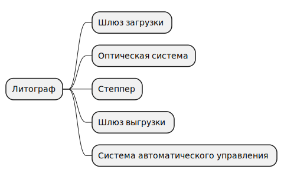
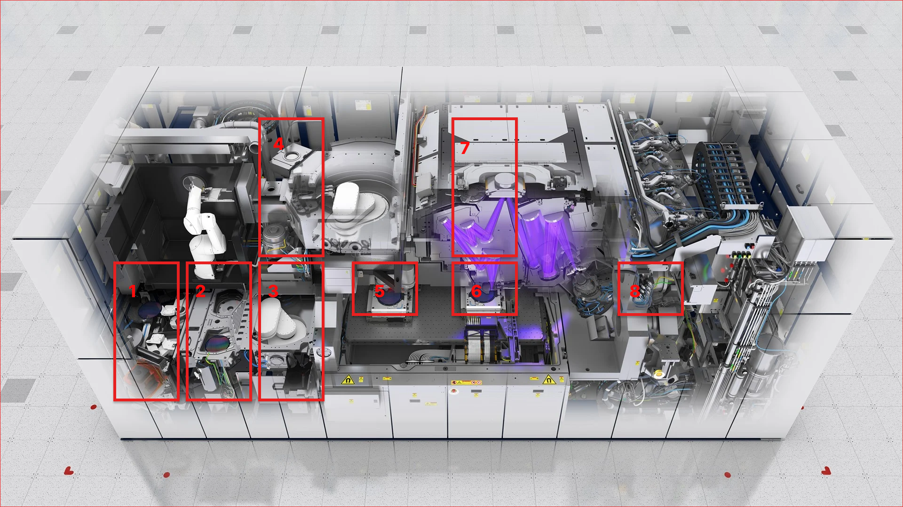

## Чем мы занимаемся и кто мы?
Мы занимаемся реверс-инжинирингом и проектированием нанолитографа 
под тех.процесс **4 нм** и под любой существующий размер пластин
от **100 мм до 450 мм**. Мы - это просто [группа в Telegram](https://t.me/nirpg_ru), в которой присутствуют как специалисты, так и просто интересующиеся микроэлектроникой участники. Вы тоже можете стать частью этой группы. Основные проектировщики:
**Денис Шилов** и **Missclick Очепятка**
## Возможно ли это в принципе?
Да. Спроектировать литограф - возможно. Есть миллиард сложностей на этом пути и проектирование литографа это только одно маленькое звено из всей цепочки сложного превращения песчинки кремния в высокотехнологичный процессор, но у нас нет другого выхода.
## Знаем ли мы что такое вообще производство, что оно стоит миллиарды долларов и как его построить в условиях изоляции?
Да. Мы все знаем, что такое чистые комнаты, манипуляторы, бизнес-планы, стены. Мы, конечно, все миллионы раз обсуждали, что нужен даже специальный порошок для стиральных машин, которые стирают рабочую одежду специалистов. Мы знаем, что необходим софт, которым в нынешних условиях невозможно пользоваться, мы все с кем-то когда то работали и работаем и с сумасшедшими гениями и с раздолбаями и с нечистыми на руку и с прекрасными специалистами и с теми кто учил нас или кого учили мы.
Да, мы все тут умные, но бедные. Мы понимаем сложность (если выразить сложность по десятибальной шкале - это будет 15 из 10, мы все, конечно, смотрели [различные обзоры](https://www.youtube.com/watch?v=9CNH8vus0h8) возможностей российской микроэлектроники.
## Вы знаете, что помимо литографа нужен еще чистый кремний, его нарезка и доставка до фабрики?
Да, мы знаем, но на данном моменте мы сфокусированы на постройке литографа. В России делают чистый кремний (9N) в булях диаметром до 150 мм (методом зонной плавки), мы знаем печальную историю завода Нитол по производству поликремния.

## А что я получу, если вложу свои знания, опыт или финансы?
Мы не знаем.

## Технологический процесс литографа

<!--  -->

1. Шлюз загрузки 
2. Камера очистки
3. Загрузочно-установочный манипулятор
4. Маска
5. [Сканер](./stages/scanner.md)
6. Столик
7. [Оптическая система](./stages/stage.md)
8. Вакуумная система

### Эскиз литографа

### Тех.процесс литографа

Файл существует в формате VISIO - [здесь](/resources/files/IDEF0.vsd)

## Что есть на данный момент?
Мы публикуем "[Этапы проектирования](/stages/Stages.md)" — каждый элемент этапа обладает своей страницей с более подробной информацией. Возможно мы добавим [PlantUML](https://github.com/grassedge/generate-plantuml-action/blob/master/example/sample.md), но в связи с тем, что возможен переход с GitHub ( c Google Actions) на собственный хостинг - будем думать о визуализации.

## Вас кто-то поддерживает?
Пока нас поддерживает только опорно-двигательный аппарат. В результате мы получим документацию на разработку литографа со всеми необходимым капитальными (CAPEX) и операционными (OPEX) расходами, необходимыми ресурсами, найдем инвестора и начнем делать по 1 000 000 000 000 000 000 процессоров в сутка (шутка. Рынок чипов в РФ и вытекающая из этого себестоимость процессора мы примерно представляем)

## Я все понял, что мне делать то?
Если вы специалист по какому-нибудь этапу проектирования, производитель оборудования, поставщик, инженер, схемотехник, алкоголик, шпион или просто интересующийся этой темы - напишите об этом в нашей группе в [Телеграм](https://t.me/nirpg_ru)

## Как пользоваться GitHub?
Это очень просто - необходим аккаунт в github (вы можете воспользоваться при регистрации вашим google-account, например) - переходите в раздел [issue](https://github.com/TsarS/lithograph/issues), нажмите **New Issue** и пишите то, что вас интересует.
_Например_:

 _Добавьте в список производителей линз - ООО "Ромашка" на странице по EUV (ссылка на страницу), контакт такой-то._

 _Добавьте статью Иванова и Сидорова "про позиционирование пластины на столике", в ресурсы на страницу такую-то._

 _Зачем поддерживать в камере сверхвысокий вакуум, есть предложение сделать ....._
 
Внутри каждого issue может идти обсуждение, после чего администратором делается **pull request** и информация, если она необходима, добавится на страницу. Так же информация, конечно, просто может быть добавлена администратором из чата в Телеграм.
Все изменения (как и предыдущие варианты) будут видны в [Pull Request](https://github.com/TsarS/lithograph/pulls)

