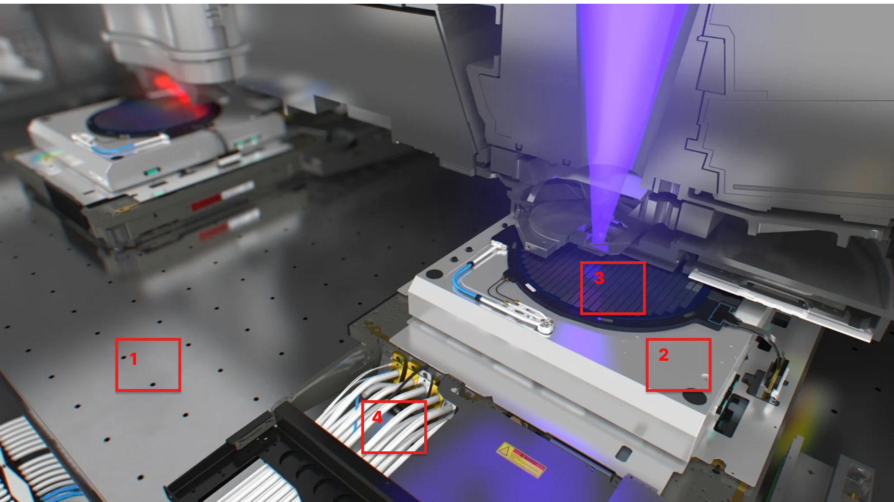
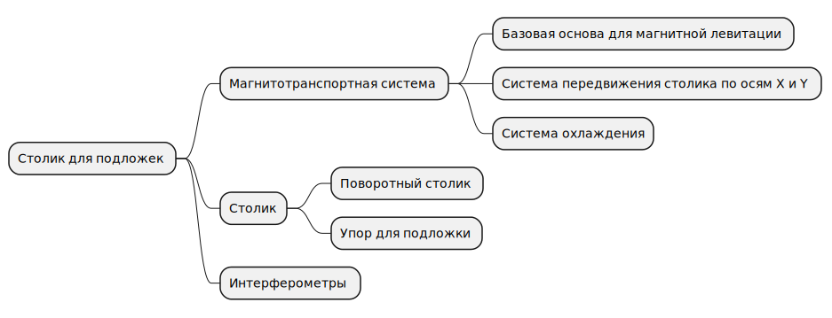

# Столик для подложек

## Описание

1. [Стол для магнитной левитации](maglev_stages.md)
2. Левитирующий столик
3. Поворотный столик
4. Обслуживающая связка левитирующего столика (кабели коммуникации, трубопроводы охлаждения)

## References
- [Рендер видео работы столика от ASML](https://www.youtube.com/watch?v=e-WdlVgp9-w)
- [Mechanical Analysis of Sandwiched Maglev 2DPositioning Stage](https://iopscience.iop.org/article/10.1088/1757-899X/677/2/022030/pdf)